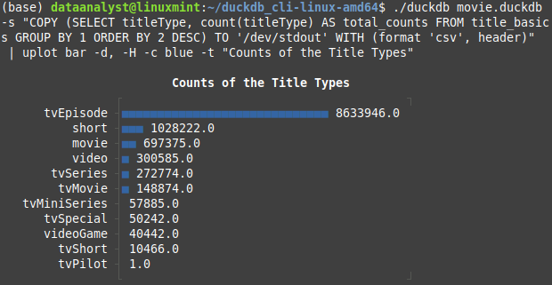

<div align="center">
  
  <hr>

Information courtesy of
IMDb
(https://www.imdb.com).
Used with permission.
</div>

## Import data into DuckDB
```
./duckdb your_database.duckdb
```

```
CREATE TABLE your_tables AS
  SELECT * FROM read_csv('/your_directory/*.*.tsv',
    delim='\t',
    null_padding=true,
    sample_size=-1);
```

```
.tables
```

```
SELECT * FROM your_tables;
```

## Quick visualisation using Youplot
```
./duckdb your_database.duckdb -s \
"COPY (SELECT titleType, count(titleType) AS total_counts \
FROM your_table GROUP BY 1 ORDER BY 2 DESC) \
TO '/dev/stdout' WITH (format 'csv', header)"  \
| uplot bar -d, -H -c blue -t "Counts of the Title Types"
```
<p align="center">
  
</p>

## Data migration from DuckDB to PostgreSQL

## Data analysis

## Visualisation using Gnuplot


#### References
[IMDb Non-Commercial Datasets](https://developer.imdb.com/non-commercial-datasets/) \
[Youplot](https://github.com/red-data-tools/YouPlot) \
[DuckDB](https://duckdb.org/docs/api/overview) \
[PostgreSQL](https://www.postgresql.org/) \
[Gnuplot](http://www.gnuplot.info/)