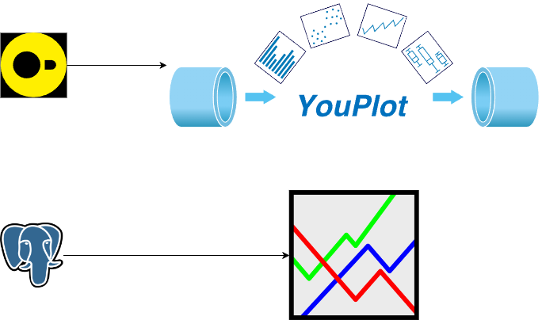
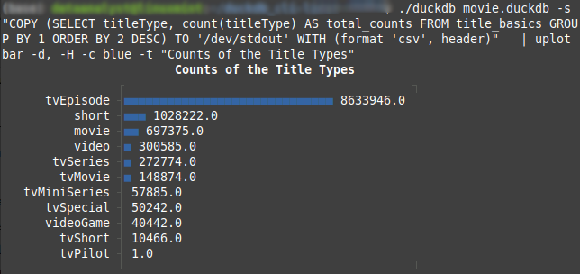
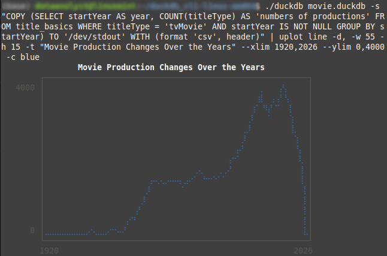
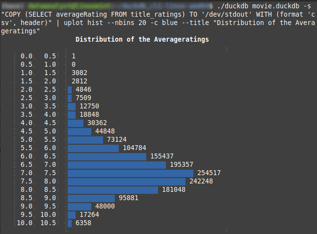
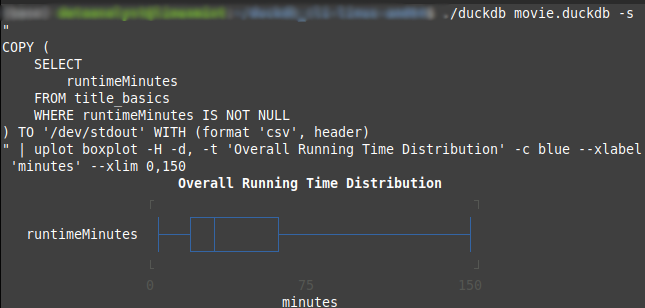
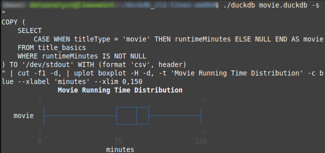
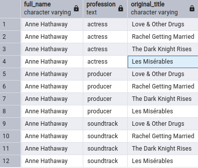
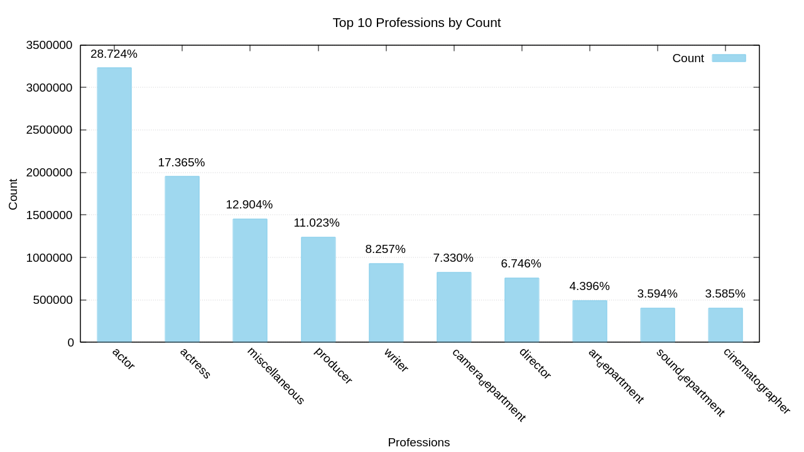

<div align="center">
  

Information courtesy of
IMDb
(https://www.imdb.com).
Used with permission.
</div>

<hr>

## Table of Contents
1. [Introduction](#introduction)
2. [Import Data into DuckDB](#import-data-into-duckdb)
3. [Quick Visualisation with YouPlot](#quick-visualisation-using-youplot)
4. [Data Migration to PostgreSQL](#data-migration-from-duckdb-to-postgresql)
5. [Data Transforamtion and Analysis in PostgreSQL](#data-analysis-in-postgresql)
6. [Visualisation using Gnuplot](#visualisation-using-gnuplot)
7. [References](#references)

## Introduction
In this project, the data released by IMDb, an extremely popular source for movie, TV and celebrity content, were analysed using **SQL** (DuckDB and PostgreSQL). 
Visualisations were presented by **Gnuplot** and *Youplot* (an interesting and convenient tool for visualing via DuckDB CLI).

## Import data into DuckDB
```
./duckdb your_database.duckdb
```

```
CREATE TABLE your_tables AS
  SELECT * FROM read_csv('/your_directory/*.*.tsv',
    delim='\t',
    null_padding=true,
    sample_size=-1);
```

```
.tables
```

```
SELECT * FROM your_tables;
```

## Quick visualisation using Youplot
### title type counts
```
./duckdb your_database.duckdb -s \
"COPY (SELECT titleType, count(titleType) AS total_counts \
FROM your_table GROUP BY 1 ORDER BY 2 DESC) \
TO '/dev/stdout' WITH (format 'csv', header)"  \
| uplot bar -d, -H -c blue -t "Counts of the Title Types"
```
<p align="center">
  
</p>

### movie production trend
```
./duckdb your_database.duckdb -s \
"COPY (SELECT startYear AS year, COUNT(titleType) AS 'numbers of productions' \
FROM your_table WHERE titleType = 'tvMovie' AND startYear IS NOT NULL \
GROUP BY startYear) TO '/dev/stdout' WITH (format 'csv', header)" \
| uplot line -d, -w 55 -h 15 -t "Movie Production Changes Over the Years" \
--xlim 1920,2026 --ylim 0,4000 -c blue
```
<p align="center">
  
</p>

### average rating distribution
```
./duckdb your_database.duckdb -s \
"COPY (SELECT averageRating FROM your_table) \
TO '/dev/stdout' WITH (format 'csv', header)" \
| uplot hist --nbins 20 -c blue --title "Distribution of the Averageratings"
```
<p align="center">
  
</p>

### running time distribution
```
./duckdb your_database.duckdb -s "
COPY (
    SELECT 
        runtimeMinutes
    FROM your_table 
    WHERE runtimeMinutes IS NOT NULL) TO '/dev/stdout' WITH (format 'csv', header)
" | uplot boxplot -H -d, -t 'Overall Running Time Distribution' 
-c blue --xlabel 'minutes' --xlim 0,150
```

```
./duckdb your_database.duckdb -s "
COPY (
    SELECT 
        CASE WHEN titleType = 'movie' THEN runtimeMinutes ELSE NULL END AS movie,
    FROM your_table 
    WHERE runtimeMinutes IS NOT NULL
) TO '/dev/stdout' WITH (format 'csv', header)
" | cut -f1 -d, | uplot boxplot -H -d, -t 'Movie Running Time Distribution' 
-c blue --xlabel 'minutes' --xlim 0,150
```


<p align='center' style="font-size:18px">
  <strong>overall  V.S.  movie</strong>
</p>

<p align="center">
  
  
</p>


## Data migration from DuckDB to PostgreSQL

### Access database through DuckDB CLI
```
./duckdb your_databse.duckdb
```

### Load postgres extension
```
#INSTALL postgres;
LOAD postgres;
```

### Create connection with PostgreSQL Database
```
CREATE SECRET (
      TYPE POSTGRES,
      HOST '127.0.0.1',
      PORT 5432,
      DATABASE your_database,
      USER 'your_user',
      PASSWORD 'your_password'
  );

ATTACH '' AS postgres_db (TYPE POSTGRES);
```

### Create table in PostgresSQL through the connection
```
CREATE TABLE postgres_db.your_tables (
      *** VARCHAR,
      *** VARCHAR,
      *** INT,
      *** INT
);
```

### Verify the existence of the table in Postgres
```
#SHOW ALL TABLES;
SELECT * FROM postgres_db.your_tables;
```

### Copy from DuckDB to Postgres
```
INSERT INTO postgres_db.your_tables
  SELECT * FROM your_tables;
```

## Data transformation and analysis in PostgreSQL
### Data transforamtion
- [name transformation](name_transformation.sql): split the professions and the known-for titles of the people into
new tables

<p align='center' style="font-size:16px">
  <strong>Name info analysis after transformation</strong> 
</p>

<p align="center">
  
</p>

- [genre transformation](genre_transformation.sql): split the genres into new table

- [crew member transformation](crewmember_transformation.sql): split the directors and writers of the programs into new tables


### [Data analysis](data_analysis.sql)

## Visualisation using Gnuplot

<p style="font-size:16px">
  <strong>1. Profession analysis</strong>
</p>

<p align="center">
  
</p>


## References
[IMDb Non-Commercial Datasets](https://developer.imdb.com/non-commercial-datasets/) \
[Youplot](https://github.com/red-data-tools/YouPlot) \
[DuckDB](https://duckdb.org/docs/api/overview) \
[PostgreSQL](https://www.postgresql.org/) \
[Gnuplot](http://www.gnuplot.info/)